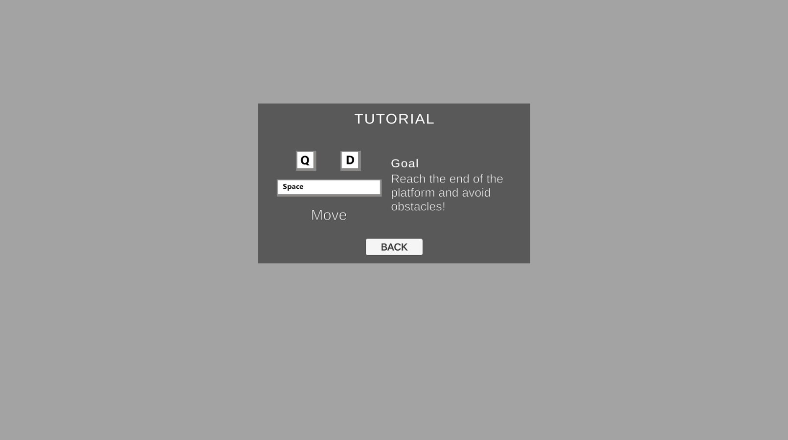
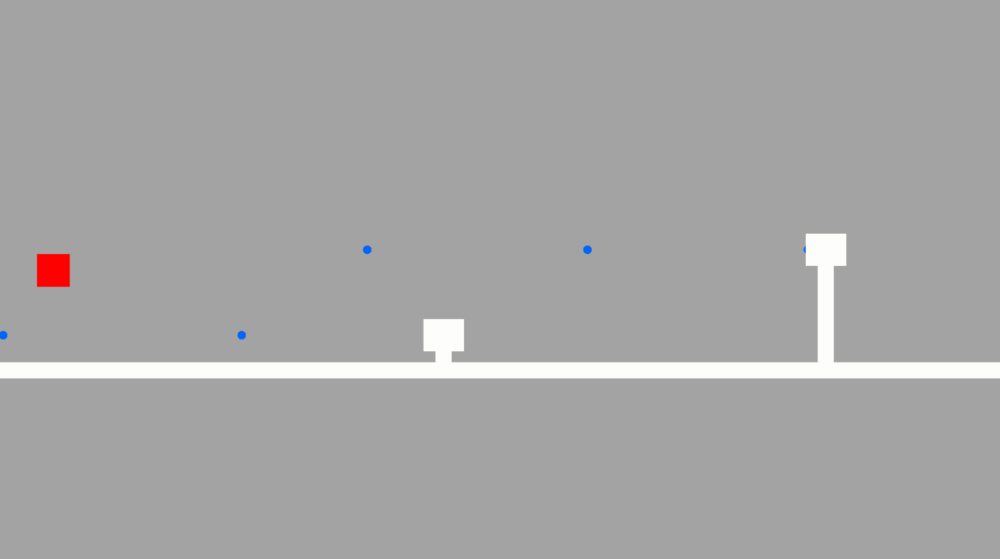
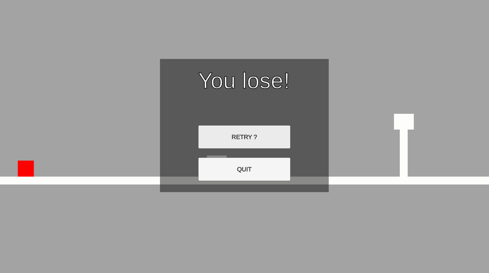

# Template Game Jam

## Goal
Be able to start a Game Jam from a Unity project that handle a very simple game loop.

### WARNING
There is tons of way to manage a game loop, here is a very simple one and easy to iterate on but not clean at all, goal is to be fast and efficient during a Game Jam.
This version of the template has been made in couple hours only, maybe better versions will come by time!
  

## Prerequisite
- Unity 2021.3.9f1 (Should works with pretty much all Unity version but here is the version used to create the project)

## UI
- UI system selected is UGUI and not UITK in order to iterate faster.

## Audio
- Audio management isn't present.

## Renderer pipeine
- Universal render pipeline with URP 2D asset

## Platform
- This template is only setup for Windows for now in full screen resolution.

## Package installed:
- TextMesh Pro
- Unity Recorder (If you'd like to record videos directly from Unity to show your work)
- 2D Animation
- 2D Pixel Perfect
- 2D Sprite
- 2D SpriteShape
- 2D Tilemap Editor
- 2D Tilemap Extras
- Universal Render Pipeline

## Game Loop
The Game loop integrate:
- Main menu

- Tutorial menu

- Gameplay phase

- Retry menu

